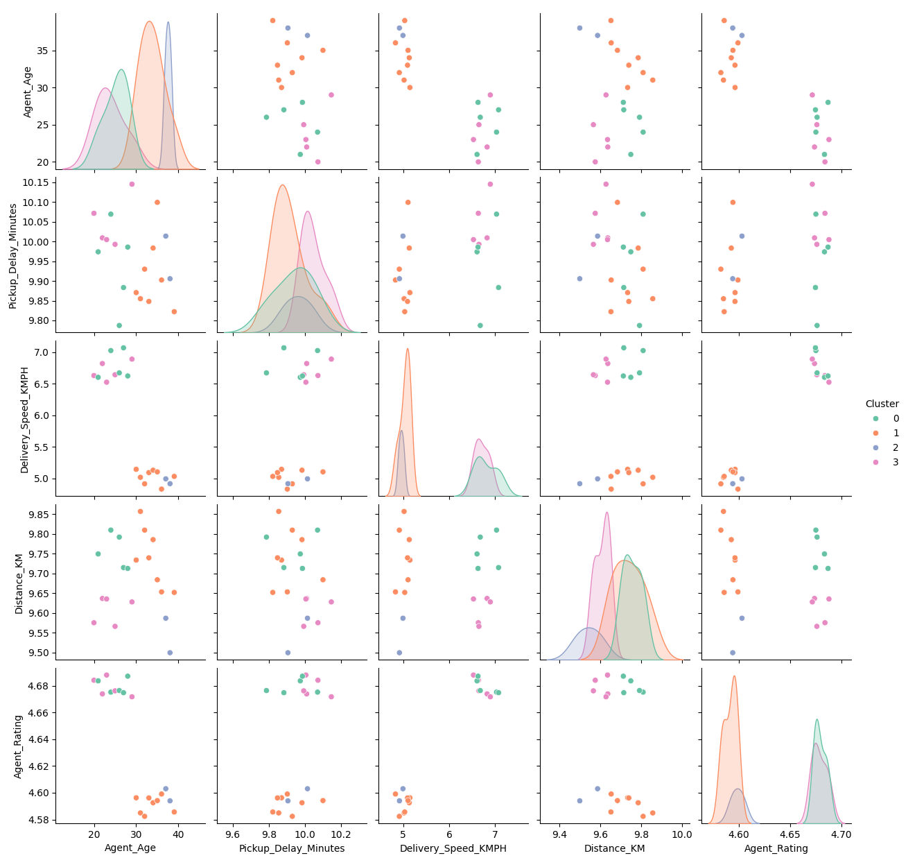

# 🚚 Rider Performance Analysis – Amazon Last-Mile Delivery

This project analyzes rider performance data from Amazon's last-mile delivery operations using Python, Jupyter Notebooks, and Streamlit. It covers the full cycle of data cleaning, exploratory analysis, clustering, loyalty segmentation, and dashboard deployment.

---

## 📁 Project Structure

```
amazon-rider-experience/
│
├── 📂 data/
│   ├── 📂 raw/ → original file: `amazon_delivery.csv`
│   └── 📂 processed/ → 
│       ├── `cleaned_amazon.csv` (cleaned dataset)
│       └── `riders_loyalty.csv` (loyalty tier assignments)
│
├── 📂 notebooks/ → 4 Jupyter Notebooks:
│   ├── 01_data_cleaning.ipynb
│   ├── 02_exploratory_analysis.ipynb
│   ├── 03_rider_clustering.ipynb
│   └── 04_loyalty_segmentation.ipynb
│
├── 📂 reports/
│   ├── `kpis_summary.csv` → extracted KPIs
│   └── 📂 screenshots/ → visualization PNGs:
│       ├── pickup_delay_distribution.png
│       ├── speed_by_vehicle.png
│       ├── delivery_time_by_traffic.png
│       ├── correlation_matrix.png
│       ├── rider_clusters.png
│       └── loyalty_tiers.png
│
├── 📂 apps/
│   └── streamlit_app2.py → interactive dashboard
│
├── requirements.txt
└── README.md
```

---

## 📊 Main Features

- Data cleaning and feature engineering from real-world last-mile delivery dataset
- Descriptive KPI generation (pickup delay, delivery speed, on-time rate, etc.)
- Clustering of riders based on behavioral metrics
- Loyalty tier segmentation (Bronze, Silver, Gold)
- Interactive dashboard built with Streamlit for filtering and visualizing rider performance

---

## 🚀 Run the Dashboard

```bash
pip install -r requirements.txt
streamlit run apps/streamlit_app2.py
```

---

## 📌 Example Visualizations

| Loyalty Tiers | Rider Clusters |
|---------------|----------------|
|  |  |

---

## 🧠 Insights

- Majority of riders fall under the Bronze tier, indicating opportunities for operational or behavioral improvement.
- Delivery performance varies significantly by traffic conditions and vehicle type.
- Clustered rider profiles help differentiate fast/reliable vs. inconsistent performers.

---

## 📁 Dataset

The dataset used is a public synthetic Amazon last mile delivery file with about 43k records.  
All sensitive columns have been anonymized or simulated.

---

## 📬 Contact

Feel free to reach out if you'd like to collaborate or discuss insights.  
LinkedIn:https://www.linkedin.com/in/hamed-fallah-092147315/
Email: hamedfallah7007@gmail.com

